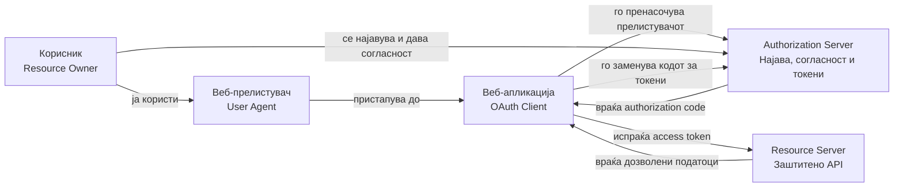
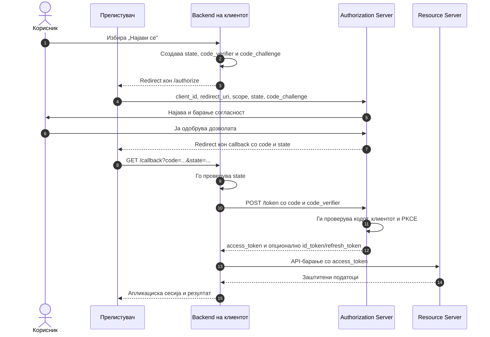
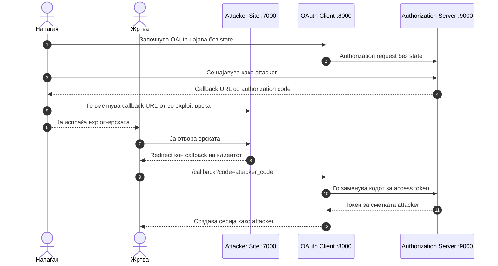

# OAuth 2.0: анализа на Login CSRF ранливост

**Проектна задача:** OAuth 2.0 и JWT ранливости — OAuth дел  
**Елаборат**  
**Автор:** Љупчо Ангеловски — 221563  
**Датум:** 20.09.2026

## Апстракт

Во елаборатот се разгледува OAuth 2.0 Login CSRF, пропуст што настанува кога клиентската апликација не го поврзува авторизацискиот одговор со прелистувачот што го започнал барањето. Во локална лабораторија напаѓачот добива authorization code за сопствената сметка и го доставува callback-от до жртвата. Ранливиот клиент го прифаќа кодот и ја најавува жртвата во сметката на напаѓачот. Демонстрацијата завршува со повторување на истиот обид врз варијанта што го проверува параметарот `state`. Приложени се конфигурацијата на околината, чекори за репродукција, очекувани резултати и постапка за бришење.

Текстот го опфаќа OAuth делот од проектната задача. JWT ранливостите се предмет на посебниот дел.

## Вовед и цел

OAuth 2.0 се користи кога апликација треба да добие ограничен пристап до ресурсите на корисникот без да ја преземе неговата лозинка. Бидејќи текот вклучува пренасочувања низ прелистувачот, клиентот мора да утврди дали добиениот одговор се однесува на барањето што самиот го започнал. Целта на оваа вежба е да се покаже што се случува кога таа проверка недостасува и како се менува исходот откако ќе се додаде.

## 1. Теоретска основа на OAuth 2.0 и OpenID Connect

### 1.1. Што претставува OAuth 2.0?

OAuth 2.0 е рамка за делегирана авторизација. Неговата цел е на една апликација да ѝ овозможи ограничен пристап до ресурси што му припаѓаат на корисникот, без корисникот да ѝ ја открие својата лозинка.

На пример, една веб-апликација може да побара дозвола да го прочита календарот на корисникот. Наместо корисникот да ги внесе своите Google или Microsoft корисничко име и лозинка директно во апликацијата, тој се пренасочува кон официјалниот сервер на давателот на услугата. По успешна најава и дадена согласност, апликацијата добива токен со ограничени привилегии.

Важно е да се направи разлика меѓу:

- **автентикација** – утврдување кој е корисникот;
- **авторизација** – утврдување до кои ресурси и операции има пристап.

OAuth 2.0 првенствено ја решава авторизацијата. Иако корисникот се најавува кај OAuth провајдерот, основниот OAuth протокол не му обезбедува на клиентот стандарден и сигурен доказ за идентитетот на корисникот. За таа цел се користи OpenID Connect.

OAuth 2.0 ги дефинира улогите и размената на пораки, но не го пропишува форматот на секој токен. Поради тоа, access token може да биде JWT, но може да биде и случајна, непроѕирна вредност. OAuth и JWT не се ист концепт: OAuth е авторизациска рамка, додека JWT е формат за претставување потпишани тврдења.

Основниот OAuth 2.0 модел е дефиниран во [RFC 6749](https://www.rfc-editor.org/rfc/rfc6749.html), додека современите безбедносни препораки се опишани во [RFC 9700](https://www.rfc-editor.org/rfc/rfc9700.html).

### 1.2. Учесници во OAuth 2.0

Во типично OAuth сценарио учествуваат следниве страни:

- **Resource Owner** – корисникот кој е сопственик на податоците.
- **Client** – апликацијата што бара пристап до податоците. Клиент е апликацијата, а не корисникот.
- **Authorization Server** – серверот кој го автентицира корисникот, бара согласност и издава кодови и токени.
- **Resource Server** – API-серверот на кој се наоѓаат заштитените податоци.
- **User Agent** – најчесто веб-прелистувачот преку кој се извршуваат пренасочувањата.

Во реални системи Authorization Server и Resource Server често припаѓаат на иста организација, но претставуваат различни логички улоги.



### 1.3. Authorization Code Flow со PKCE

Во реални апликации се препорачува **Authorization Code Flow со PKCE**. Следниот дијаграм го прикажува референтниот, правилно заштитен тек. **Лабораторијата подолу намерно имплементира поедноставен Authorization Code Flow без PKCE и OIDC**, за да се изолира грешката со `state`; таа не е пример за целосна продукциска имплементација.

Процесот започнува кога корисникот ќе избере опција како „Најави се со OAuth провајдер“. Клиентската апликација создава авторизациско барање и го пренасочува прелистувачот кон Authorization Server.

Барањето вообичаено ги содржи следниве параметри:

- `response_type=code` – означува дека клиентот бара authorization code;
- `client_id` – јавен идентификатор на клиентската апликација;
- `redirect_uri` – адресата на која ќе биде вратен прелистувачот;
- `scope` – дозволите што ги бара апликацијата;
- `state` – случајна вредност за поврзување на одговорот со започнатата сесија;
- `code_challenge` – PKCE вредност добиена од таен `code_verifier`;
- `code_challenge_method=S256` – означува дека се користи SHA-256.

`client_id` не е кориснички идентификатор и не е тајна. Тој само кажува која апликација го започнала OAuth процесот.

По автентикацијата и согласноста, Authorization Server го пренасочува прелистувачот кон регистрираниот `redirect_uri`. Во URL-адресата се испраќаат `code` и претходно испратениот `state`.

Authorization code е краткотрајна и еднократна вредност која клиентот не треба да ја анализира. Тој не претставува access token и сам по себе не содржи информации што апликацијата треба да ги користи. Неговата единствена цел е да биде заменет за токени преку token endpoint.



Делот што поминува преку прелистувачот се нарекува **front channel**. Тој е изложен на историјата на прелистувачот, пренасочувања, екстензии, несигурни callback адреси и други потенцијални извори на протекување. Поради тоа, низ него се пренесува само краткотрајниот authorization code.

Размената на кодот за токени се извршува преку **back channel**, од backend-от на клиентот директно кон token endpoint, преку HTTPS. Access token не треба да се враќа како параметар во URL-адресата.

### 1.4. Улогата на PKCE

PKCE – Proof Key for Code Exchange – го поврзува authorization code со конкретната апликациска сесија што го започнала процесот.

Пред пренасочувањето, клиентот создава случаен `code_verifier`. Од него се пресметува `code_challenge`:

```text
code_challenge = BASE64URL(SHA256(code_verifier))
```

Во првото барање се испраќа само `code_challenge`, додека оригиналниот `code_verifier` се чува кај клиентот. При размената на authorization code, клиентот мора да го достави соодветниот `code_verifier`.

Доколку напаѓачот го пресретне authorization code, нема да може да го замени за access token без оригиналниот `code_verifier`. PKCE првично бил создаден за јавни мобилни клиенти, но современите препораки го бараат за јавни клиенти и го препорачуваат и за доверливи веб-клиенти. Треба да се користи методот `S256`, а не `plain`. Механизмот е дефиниран во [RFC 7636](https://www.rfc-editor.org/rfc/rfc7636.html), а неговата примена за сите видови клиенти е препорачана во [RFC 9700](https://www.rfc-editor.org/rfc/rfc9700.html).

### 1.5. Access token, refresh token и scope

**Access token** е акредитив со кој клиентот пристапува до Resource Server. Тој вообичаено се испраќа во HTTP заглавието:

```http
Authorization: Bearer <access_token>
```

Најголем дел од access token-ите се bearer tokens. Тоа значи дека секој што ќе дојде до токенот може да го употреби додека тој е валиден. Затоа access token не треба да се запишува во логови, да се става во URL-параметри или непотребно да се чува во прелистувачот. [RFC 6750](https://www.rfc-editor.org/rfc/rfc6750.html) особено предупредува дека токените во URL можат да протечат преку browser history, серверски логови и други системи.

**Scope** го определува опсегот на доделениот пристап, на пример:

```text
scope=calendar.read profile
```

Токенот треба да ги содржи само неопходните дозволи. Барање премногу широки scope-вредности го зголемува влијанието на евентуално компромитирање.

**Refresh token** се користи за добивање нов access token без повторна интеракција со корисникот. Поради неговиот подолг животен век, тој претставува особено чувствителен акредитив. Во server-side архитектура треба да остане на backend-от; кај мобилни и други јавни клиенти мора да се користи соодветно безбедно складирање и мерки како refresh token rotation или поврзување со конкретен испраќач.

### 1.6. OpenID Connect и автентикација на корисникот

OAuth access token му кажува на Resource Server кои операции се дозволени, но не е наменет да служи како доказ за најава во клиентската апликација.

**OpenID Connect – OIDC** е идентитетски слој изграден над OAuth 2.0. Тој се активира со додавање на scope-вредноста `openid`:

```text
scope=openid profile email
```

Во тој случај, покрај access token, клиентот добива и **ID token**. ID token е JWT наменет за клиентската апликација и содржи тврдења како:

- `iss` – кој провајдер го издал токенот;
- `sub` – уникатен идентификатор на корисникот кај тој провајдер;
- `aud` – клиентот за кој е издаден токенот;
- `exp` – време на истекување;
- `iat` – време на издавање;
- `nonce` – вредност за поврзување со започнатото барање и заштита од повторување.

Клиентот мора да го провери дигиталниот потпис, очекуваниот `iss`, сопствениот `client_id` во `aud`, времето на важност и `nonce`, кога тој бил употребен. Самото декодирање на JWT не претставува валидација.

За локално идентификување на корисникот треба да се користи комбинацијата `iss` и `sub`, а не адресата за е-пошта, бидејќи е-поштата може да се промени или повторно да биде доделена. OpenID Connect е дефиниран во [OpenID Connect Core 1.0](https://openid.net/specs/openid-connect-core-1_0.html).

Во избраното server-side сценарио, по успешната проверка на ID token, backend-от го поврзува `sub` со запис во локалната база и создава сопствена апликациска сесија. Кон прелистувачот може да се испрати безбедно session cookie со `HttpOnly`, `Secure` и соодветна `SameSite` политика. Надворешниот ID token не треба некритички да се препраќа и да се користи како општ токен на самата апликација.

### 1.7. Каде се појавуваат OAuth ранливостите?

OAuth ранливостите најчесто не се резултат на слабост во самиот стандард, туку на погрешна имплементација, несигурна конфигурација или неточно поставени граници на доверба.

Најзначајни извори на пропусти се:

1. **Недостасувачки или неправилно поврзан `state`**  
   Напаѓачот може да внесе сопствен OAuth одговор во сесијата на жртвата и да предизвика Login CSRF или погрешно поврзување кориснички сметки.

2. **Слаба проверка на `redirect_uri`**  
   Ако Authorization Server дозволува делумно совпаѓање, wildcard адреси или произволни поддомени, authorization code може да биде испратен кон адреса под контрола на напаѓачот. Современите препораки бараат точно споредување со претходно регистрираната адреса.

3. **Отсуство на PKCE**  
   Украден или инјектиран authorization code може да се замени за токени. PKCE го спречува ова со поврзување на кодот со оригиналниот `code_verifier`.

4. **Протекување и повторна употреба на токени**  
   Access token може да протече преку URL, логови, browser history, JavaScript, несигурен storage или XSS. Кај bearer token, неговото поседување најчесто е доволно за пристап.

5. **OAuth се користи како протокол за најава без OIDC**  
   Клиентот може погрешно да претпостави дека секој валиден access token го идентификува тековниот корисник. Ова може да доведе до token substitution или прифаќање токен наменет за друго API.

6. **Неправилна валидација на ID token**  
   Ако не се проверат потписот, `iss`, `aud`, `exp` и `nonce`, апликацијата може да прифати токен издаден од погрешен провајдер, за друга апликација или за стара сесија.

7. **Несоодветно управување со client secret**  
   SPA и мобилните апликации се јавни клиенти. Тајна вградена во JavaScript код или мобилна апликација не може да се смета за доверлива.

8. **Стари или несигурни OAuth текови**  
   Современите препораки советуваат да не се користи Implicit Grant, затоа што access token се враќа преку front channel и е изложен на протекување. Resource Owner Password Credentials Grant не треба воопшто да се користи, бидејќи клиентот директно ја добива лозинката на корисникот. Наместо нив се користи Authorization Code Flow со PKCE.

Наведените пропусти служат како контекст. Во практичниот дел се испитува само Login CSRF; останатите не се експлоатираат во оваа лабораторија.

## 2. Практичен дел

### 2.1. Избрана ранливост: OAuth Login CSRF поради недостасувачки `state`

Практичниот дел демонстрира OAuth Login CSRF ранливост која се појавува кога клиентската апликација не го испраќа и не го проверува параметарот `state`.

Во нормален OAuth процес, клиентот создава случајна `state` вредност пред да го пренасочи корисникот кон Authorization Server. Вредноста се чува во сесијата на корисникот и се испраќа во authorization request. Authorization Server ја враќа истата вредност заедно со authorization code. Клиентот смее да го продолжи процесот само ако вратениот `state` се совпаѓа со вредноста зачувана за истиот прелистувач.

Ранливата апликација од оваа лабораторија воопшто не користи `state`. Поради тоа, таа прифаќа authorization code без да провери дали OAuth процесот бил започнат од истиот прелистувач. Напаѓачот може да започне најава со сопствената OAuth сметка, да го пресретне callback URL-от и потоа да ја наведе жртвата да го отвори. Апликацијата ќе создаде сесија во прелистувачот на жртвата, но таа сесија ќе биде поврзана со сметката на напаѓачот.

Овој напад обично не му ја открива сметката на жртвата директно на напаѓачот. Опасноста е во тоа што жртвата може да внесе чувствителни податоци или да изврши дејства мислејќи дека работи во сопствената сметка. Податоците всушност се зачувуваат во сметката на напаѓачот, кој подоцна може да ги прочита.

### 2.2. Дефинирано лабораториско сценарио

Лабораторијата се состои од три намерно поедноставени веб-сервиси:

| Компонента | Адреса | Улога |
|---|---|---|
| LabID Authorization Server | `http://localhost:9000` | Го симулира OAuth провајдерот, издава authorization codes и access tokens |
| OAuth Notes Client | `http://localhost:8000` | Клиентска апликација која содржи ранлив и заштитен OAuth flow |
| Attacker Lab Site | `http://127.0.0.1:7000` | Страница под контрола на напаѓачот која ја доставува малициозната callback-врска |



За да биде вежбата изводлива и за корисник без искуство со interception proxy, Authorization Server содржи опција **Lab capture**. Таа го прикажува callback URL-от наместо веднаш да го следи HTTP пренасочувањето. Во реално тестирање истата вредност би можела да се пресретне преку алатка како Burp Suite. Lab capture не ја создава ранливоста; тој само го поедноставува набљудувањето на OAuth одговорот.

**Ограничувања на моделот:** LabID ги симулира логирањето и согласноста со избор на една од две тест-сметки, без вистинска лозинка. Клиентот користи поедноставен профилен endpoint за демонстрациска сесија; ова **не е OpenID Connect** и не треба да се копира како начин за продукциска автентикација. Во лабораторијата нема PKCE, client authentication, refresh tokens или HTTPS. Тие механизми се изоставени за да се анализира само една ранливост; во реална апликација мора да се дизајнираат и проверуваат одделно. `localhost` и `127.0.0.1` се различни browser host-имиња: така страницата на напаѓачот не ги споделува cookies на клиентот, иако двата сервиса работат на ист компјутер. Cookies не се изолираат само по TCP-порта.

### 2.3. Потребен хардвер и софтвер

За изведување на лабораторијата се потребни:

- компјутер со најмалку 4 GB RAM-меморија (повеќе е препорачливо за Docker Desktop);
- Windows, macOS или Linux оперативен систем;
- Docker Desktop или Docker Engine со Docker Compose;
- современ веб-прелистувач со можност за отворање приватен/incognito прозорец;
- слободни локални TCP-порти `7000`, `8000` и `9000`;
- копија од директориумот `lab/oauth-csrf` што е приложен со проектот.

Ако Docker не е инсталиран, треба да се преземе од **официјалната** документација за соодветниот систем: [Windows](https://docs.docker.com/desktop/setup/install/windows-install/), [macOS](https://docs.docker.com/desktop/setup/install/mac-install/) или [Linux](https://docs.docker.com/desktop/setup/install/linux/). На Windows при инсталацијата се избира Linux-container backend (вообичаено WSL 2), а потоа се стартува Docker Desktop. На macOS се избира верзијата за Apple silicon или Intel според компјутерот. На Linux може да се користи Docker Desktop или Docker Engine со Compose plugin. Конкретните системски предуслови и инсталациски чекори зависат од верзијата на оперативниот систем; официјалните упатства треба да се следат пред продолжување.

Инсталацијата може да се провери со следниве команди:

```bash
docker --version
docker compose version
```

Двете команди треба да прикажат број на верзија. Ако се користи Docker Desktop, апликацијата мора да биде стартувана пред продолжување со вежбата.

### 2.4. Безбедносно предупредување и изолација

Околината е намерно ранлива и е наменета исклучиво за локална едукација. Не смее да се поставува на јавен сервер или да се користи за тестирање туѓи OAuth апликации и кориснички сметки без изречна дозвола.

Лабораторијата ги објавува сервисите само на loopback-интерфејсот `127.0.0.1`. Поради тоа, тие се достапни од локалниот компјутер, но не и од други уреди во локалната мрежа. Контејнерите меѓусебно комуницираат преку посебна Docker bridge-мрежа. **Ова не е целосна мрежна изолација:** Docker bridge по правило може да овозможи излезен сообраќај. Ако се бара построга изолација од постоечки мрежи, вежбата треба да се изведе во одделна виртуелна машина или на тест-компјутер без мрежна врска по преземањето на основната Docker слика. Во лабораторијата не треба да се внесуваат вистински лозинки, токени или лични податоци.

Сите authorization codes, access tokens, сесии и белешки се чуваат само во RAM-меморијата на сервисите. Тие исчезнуваат кога контејнерите ќе бидат запрени. Не се користат Docker volumes и не се менува конфигурацијата на оперативниот систем.

### 2.5. Подигнување на лабораториската околина

#### Чекор 1: Отворање терминал

На Windows може да се користи PowerShell, а на macOS или Linux апликацијата Terminal. За првото подигнување е потребна интернет-врска за преземање на официјалната Node.js Docker слика, освен ако таа веќе е локално зачувана.

#### Чекор 2: Позиционирање во лабораторискиот директориум

Во управувачот со датотеки пронајдете ја папката на проектот, а во неа `lab/oauth-csrf`. Отворете терминал **во таа папка**. На Windows, во File Explorer може да се кликне во адресната лента на папката, да се внесе `powershell` и да се притисне Enter. На macOS/Linux може да се отвори Terminal и да се внесе `cd ` (со празно место), да се повлече папката `oauth-csrf` во прозорецот и да се притисне Enter.

Проверете дека сте во правилната папка:

```bash
docker compose config --services
```

Очекуваниот излез содржи `auth-server`, `client` и `attacker-site`. Ако командата јави дека нема `compose.yaml`, терминалот е отворен во погрешна папка.

#### Чекор 3: Градење и стартување на сервисите

```bash
docker compose up --build
```

При првото стартување Docker може да ја преземе основната Node.js слика, поради што е потребна интернет-врска. По успешно стартување треба да се појават пораки слични на:

```text
LabID Authorization Server listening on 9000
OAuth client listening on 8000
Attacker lab site listening on 7000
```

Терминалот треба да остане отворен додека се изведува вежбата.

#### Чекор 4: Проверка на сервисите

Во прелистувачот одделно се отвораат:

```text
http://127.0.0.1:7000
http://localhost:8000
http://localhost:9000
```

Секоја адреса треба да прикаже различна страница. Ако некоја страница не се отвора, треба да се провери дали Docker е стартуван и дали некоја друга апликација ја користи соодветната порта.

### 2.6. Нормално однесување на апликацијата

Пред нападот може да се провери нормалниот OAuth процес:

1. Се отвора `http://localhost:8000`.
2. Се избира **Ранлива OAuth најава**.
3. Authorization Server прикажува две лабораториски сметки.
4. Се избира **Најави се како жртва**.
5. Прелистувачот се враќа во клиентската апликација.
6. Во полето „Активна апликациска сесија“ треба да биде прикажано името **Виктор Жртва** и subject `user-victim`.
7. Се избира **Одјави се** пред започнување на нападот.

Овој тест потврдува дека Authorization Code Flow функционира, но сè уште не покажува дали callback-от е поврзан со прелистувачот што ја започнал трансакцијата.

### 2.7. Експлоатација на ранливиот OAuth flow

За правилно да се симулираат два различни корисници, напаѓачот се претставува со нормалниот прозорец на прелистувачот, а жртвата со нов приватен/incognito прозорец. Не треба да се користи обичен втор tab, бидејќи може да ги сподели cookies од истиот browser-профил.

#### Фаза А: Напаѓачот создава малициозна callback-врска

1. Во нормален прозорец се отвора `http://127.0.0.1:7000`.
2. Се избира **Подготви напад врз ранливиот flow**.
3. Клиентот започнува OAuth процес без параметар `state` и го отвора LabID Authorization Server.
4. Се избира **Најави се како напаѓач**.
5. Наместо автоматско пренасочување, Lab capture прикажува URL сличен на:

   ```text
   http://localhost:8000/callback?code=<случајна-вредност>
   ```

6. Ова е валиден, краткотраен и еднократен authorization code издаден за сметката на напаѓачот. Callback-врската не треба директно да се отвори во прозорецот на напаѓачот, бидејќи кодот би бил потрошен.
7. Се избира **Пренеси ја во страницата на напаѓачот**.
8. Attacker Site прикажува exploit-врска која го пренасочува посетителот кон пресретнатиот callback.

#### Фаза Б: Жртвата ја отвора exploit-врската

1. Во нормалниот прозорец се копира **целата** exploit-врска што почнува со `http://127.0.0.1:7000/deliver?target=...`. Не се притиска копчето за отворање во тој прозорец.
2. Се отвора нов приватен/incognito прозорец. Тој прозорец ја претставува жртвата и нема OAuth state или апликациска сесија од прозорецот на напаѓачот.
3. Копираната exploit-врска се внесува во адресната лента на приватниот прозорец и се притиска Enter. Врската мора да се отвори пред да истече authorization code; ако истече, фазата А се повторува.
4. Attacker Site го пренасочува прелистувачот кон:

   ```text
   http://localhost:8000/callback?code=<attacker-code>
   ```

5. Ранливиот клиент го прифаќа кодот без да провери `state`.
6. Клиентот го испраќа кодот до token endpoint и добива access token за OAuth сметката на напаѓачот.
7. Во прелистувачот на жртвата се создава нова локална сесија.
8. Како активен корисник треба да се прикаже **Алекс Напаѓач**, иако жртвата никогаш не избрала најава со таа сметка.

Ова е моментот кога нападот е успешно извршен.

#### Фаза В: Демонстрација на влијанието

1. Во приватниот прозорец, во полето за нова белешка се внесува:

   ```text
   Доверлива белешка внесена од жртвата
   ```

2. Се избира **Зачувај**.
3. Приватниот прозорец се затвора.
4. Во нормалниот прозорец на напаѓачот се отвора `http://localhost:8000`.
5. Ако нема активна сесија, се избира **Ранлива OAuth најава**, а потоа **Најави се како напаѓач**. Овојпат не се користи Lab capture.
6. Во листата со приватни белешки на сметката на напаѓачот се појавува текстот што го внела жртвата.

Со ова се покажува практичното влијание: жртвата внела доверлив податок во сметка контролирана од напаѓачот.

| Проверка | Очекуван доказ |
|---|---|
| Ранлив callback во приватниот прозорец | Активен корисник: **Алекс Напаѓач** |
| Внесување белешка од жртвата | Белешката е зачувана под `user-attacker` |
| Нова најава на напаѓачот | Истата белешка е видлива во неговата сметка |
| Ист напад врз заштитениот callback | HTTP `403`; OAuth одговорот е одбиен |
| Легитимна заштитена најава | Клиентот прикажува **Виктор Жртва** |

### 2.8. Техничка причина за ранливоста

Ранливиот login endpoint создава authorization request без `state`:

```javascript
if (req.method === 'GET' && url.pathname === '/login') {
  return redirect(
    res,
    authorizationUrl(VULNERABLE_REDIRECT, capture)
  );
}
```

Callback endpoint-от проверува само дали е присутен authorization code. Не постои доказ дека истиот прелистувач претходно го започнал OAuth процесот. Следниот извадок е **псевдокод**, скратен од имплементацијата во `lab/oauth-csrf/client.js`:

```javascript
if (req.method === 'GET' && url.pathname === '/callback') {
  const code = url.searchParams.get('code');
  const user = await exchangeCode(code, VULNERABLE_REDIRECT);
  createApplicationSession(user);
}
```

Authorization Server издал валиден код и кодот правилно се заменува за access token. Проблемот е што кодот е издаден за OAuth трансакцијата на напаѓачот, додека локалната сесија се создава во прелистувачот на жртвата. Клиентот нема вредност со која би ги поврзал овие две операции.

### 2.9. Примена и проверка на заштитата

Заштитената варијанта ја применува следнава постапка:

1. создава криптографски случајна `state` вредност;
2. ја зачувува во краткотрајна `HttpOnly` и `SameSite=Lax` cookie-вредност поврзана со прелистувачот;
3. ја испраќа `state` вредноста во authorization request;
4. бара Authorization Server да ја врати во callback URL-от;
5. пред размена на кодот проверува дали вратениот `state` точно се совпаѓа со зачуваниот;
6. по употребата ја брише вредноста за да не може повторно да се искористи.

Поедноставена проверка изгледа вака:

```javascript
const returnedState = url.searchParams.get('state');
const expectedState = cookies.oauth_state;

if (!returnedState || !expectedState || returnedState !== expectedState) {
  return rejectOAuthResponse();
}
```

За проверка на заштитата се повторува истиот напад:

1. Во нормалниот прозорец се отвора `http://127.0.0.1:7000`.
2. Се избира **Обиди се врз заштитениот flow**.
3. Кај LabID се избира **Најави се како напаѓач**.
4. Се избира **Пренеси ја во страницата на напаѓачот**.
5. Новата exploit-врска се отвора во нов приватен/incognito прозорец.
6. Наместо успешна најава, клиентот враќа HTTP статус `403` и ја прикажува пораката **OAuth одговорот е одбиен**.

Нападот е блокиран бидејќи `state` во URL-от е создаден во прелистувачот на напаѓачот, додека приватниот прозорец на жртвата ја нема соодветната `oauth_state` cookie-вредност.

Во продукциска апликација се препорачуваат и следниве мерки:

- `state` да биде случаен, непредвидлив, еднократен и со краток рок на важност;
- вредноста да биде врзана за конкретната browser-сесија и OAuth трансакција, по можност преку серверски зачувана pending-трансакција;
- да се користи Authorization Code Flow со PKCE и метод `S256`;
- `redirect_uri` да се проверува со точно совпаѓање;
- callback endpoint-от да користи HTTPS;
- апликациските cookies да ги имаат соодветните `Secure`, `HttpOnly` и `SameSite` атрибути;
- токените да не се запишуваат во URL, browser history или апликациски логови;
- да се применат ограничени scope-вредности и краткотрајни access tokens;
- да се користи добро одржувана OAuth/OIDC библиотека наместо рачна имплементација на протоколот.

Според [RFC 9700, секција 2.1 и 4.7](https://www.rfc-editor.org/rfc/rfc9700.html), CSRF заштитата може да се обезбеди и преку **правилно имплементиран PKCE**, ако клиентот однапред потврдил дека провајдерот го поддржува и ако verifier-от е специфичен за трансакцијата и врзан за истиот прелистувач. Во оваа лабораторија PKCE не се имплементира; затоа `state` е главниот демонстриран механизам. Поуката не е дека буквално секоја OAuth апликација мора истовремено да има и `state` и PKCE, туку дека мора да има сигурна заштита од CSRF и злоупотреба на authorization code.

`SameSite` cookies можат да обезбедат дополнителна заштита, но не треба да се користат како замена за правилна OAuth transaction binding проверка.

### 2.10. Запирање и бришење на лабораториската околина

По завршување на вежбата, во терминалот каде што работи Docker Compose се притиска `Ctrl+C`.

Потоа се извршува:

```bash
docker compose down --rmi local
```

Командата ги запира и ги брише контејнерите, локалната Docker мрежа и сликата изградена за лабораторијата. Бидејќи не се користат volumes, не остануваат лабораториски корисници, белешки, OAuth codes или tokens.

За да се провери дека сервисите се изгасени, може повторно да се отвори `http://localhost:8000`. Прелистувачот треба да прикаже дека страницата не е достапна.

### 2.11. Заклучок од практичната анализа

Експериментот покажува дека валиден authorization code не е доволен доказ дека тековниот прелистувач ја започнал OAuth трансакцијата. Без `state`, клиентот може да прифати код создаден во сесија на напаѓачот и да го поврзе со сесијата на жртвата.

Последицата во прикажаното сценарио е внесување доверливи податоци во сметка контролирана од напаѓачот. Во други апликации истиот пропуст може да предизвика несакани дејства, погрешно поврзување профили или преземање сметка кога ранливоста се појавува во OAuth account-linking функционалност.

Повторувањето на нападот врз заштитениот flow потврдува дека случајна, еднократна и правилно проверена `state` вредност го поврзува OAuth одговорот со прелистувачот што го започнал процесот и го блокира Login CSRF нападот.

## Користена литература

1. D. Hardt, [RFC 6749: The OAuth 2.0 Authorization Framework](https://www.rfc-editor.org/rfc/rfc6749.html), IETF, 2012.
2. T. Lodderstedt et al., [RFC 9700: Best Current Practice for OAuth 2.0 Security](https://www.rfc-editor.org/rfc/rfc9700.html), IETF, 2025.
3. N. Sakimura et al., [RFC 7636: Proof Key for Code Exchange](https://www.rfc-editor.org/rfc/rfc7636.html), IETF, 2015.
4. M. Jones и D. Hardt, [RFC 6750: Bearer Token Usage](https://www.rfc-editor.org/rfc/rfc6750.html), IETF, 2012.
5. OpenID Foundation, [OpenID Connect Core 1.0](https://openid.net/specs/openid-connect-core-1_0.html), финална спецификација.

## Прилог: датотеки од лабораторијата

- [`lab/oauth-csrf/compose.yaml`](lab/oauth-csrf/compose.yaml) — дефиниција на трите Docker сервиси;
- [`lab/oauth-csrf/auth-server.js`](lab/oauth-csrf/auth-server.js) — поедноставен Authorization Server;
- [`lab/oauth-csrf/client.js`](lab/oauth-csrf/client.js) — ранлив и заштитен клиент;
- [`lab/oauth-csrf/attacker-site.js`](lab/oauth-csrf/attacker-site.js) — лабораториска страница на напаѓачот;
- [`lab/oauth-csrf/test-lab.js`](lab/oauth-csrf/test-lab.js) — автоматска проверка на очекуваниот исход.
